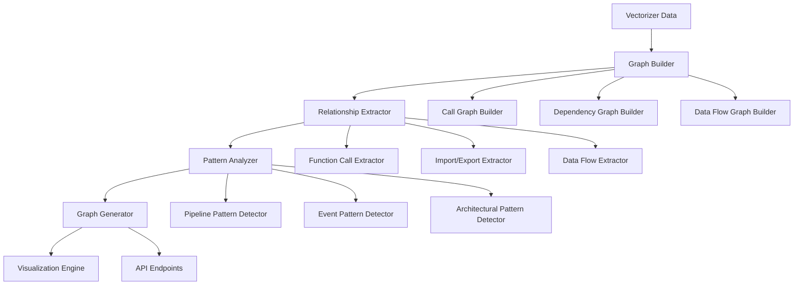

# Graph Correlation Analysis Specification

## Overview

The Graph Correlation Analysis feature enables automatic generation of code relationship graphs from Vectorizer data, providing LLMs with visual understanding of code flow, dependencies, and processing patterns.

## Objectives

- **Code Flow Visualization**: Generate graphs showing function call relationships, data flow, and execution paths
- **Dependency Mapping**: Create dependency graphs for libraries, modules, and components
- **Processing Pattern Recognition**: Identify common patterns like data pipelines, event flows, and architectural patterns
- **LLM Assistance**: Provide structured data that helps LLMs understand code context and relationships

## Architecture

### Core Components



### Data Sources

1. **Vectorizer Collections**:
   - `codebase`: Source code embeddings and metadata
   - `functions`: Function definitions and signatures
   - `imports`: Import/export relationships
   - `calls`: Function call relationships
   - `types`: Type definitions and usage

2. **Static Analysis Data**:
   - AST (Abstract Syntax Tree) information
   - Symbol tables
   - Control flow graphs
   - Data flow analysis

## Graph Types

### 1. Call Graph
- **Nodes**: Functions, methods, procedures
- **Edges**: Direct function calls
- **Metadata**: Call frequency, parameters, return types
- **Layout**: Hierarchical (caller → callee)

### 2. Dependency Graph
- **Nodes**: Modules, packages, libraries
- **Edges**: Import/export relationships
- **Metadata**: Version constraints, usage patterns
- **Layout**: Directed acyclic graph (DAG)

### 3. Data Flow Graph
- **Nodes**: Variables, data structures, APIs
- **Edges**: Data transformations, assignments
- **Metadata**: Data types, transformation functions
- **Layout**: Flow-based (source → sink)

### 4. Component Graph
- **Nodes**: Classes, interfaces, components
- **Edges**: Inheritance, composition, interfaces
- **Metadata**: Responsibilities, interfaces
- **Layout**: Object-oriented hierarchy

## Graph Generation Process

### Phase 1: Data Extraction
1. **Query Vectorizer**: Extract relevant code segments and relationships
2. **Parse AST**: Analyze code structure and dependencies
3. **Extract Metadata**: Gather type information, documentation, comments
4. **Build Symbol Table**: Create comprehensive symbol mapping

### Phase 2: Relationship Analysis
1. **Call Analysis**: Identify function calls and their contexts
2. **Import Analysis**: Map module dependencies
3. **Data Flow Analysis**: Track variable usage and transformations
4. **Pattern Recognition**: Identify common architectural patterns

### Phase 3: Graph Construction
1. **Node Creation**: Create graph nodes with metadata
2. **Edge Creation**: Establish relationships between nodes
3. **Layout Calculation**: Determine optimal node positioning
4. **Clustering**: Group related nodes for better visualization

### Phase 4: Visualization
1. **Graph Rendering**: Generate visual representation
2. **Interactive Features**: Enable zoom, pan, filter operations
3. **Export Options**: Support multiple output formats
4. **API Integration**: Provide programmatic access

## API Design

### REST Endpoints

```yaml
# Graph Generation
POST /api/v1/graphs/generate
  - body: GraphRequest
  - response: GraphResponse

# Graph Retrieval
GET /api/v1/graphs/{graph_id}
  - response: Graph

# Graph Types
GET /api/v1/graphs/types
  - response: GraphType[]

# Graph Analysis
POST /api/v1/graphs/{graph_id}/analyze
  - body: AnalysisRequest
  - response: AnalysisResult
```

### GraphQL Schema

```graphql
type Graph {
  id: ID!
  type: GraphType!
  nodes: [Node!]!
  edges: [Edge!]!
  metadata: GraphMetadata!
  createdAt: DateTime!
  updatedAt: DateTime!
}

type Node {
  id: ID!
  label: String!
  type: NodeType!
  metadata: NodeMetadata!
  position: Position!
}

type Edge {
  id: ID!
  source: ID!
  target: ID!
  type: EdgeType!
  metadata: EdgeMetadata!
}

enum GraphType {
  CALL_GRAPH
  DEPENDENCY_GRAPH
  DATA_FLOW_GRAPH
  COMPONENT_GRAPH
}

enum NodeType {
  FUNCTION
  MODULE
  CLASS
  VARIABLE
  API
  DATABASE
}

enum EdgeType {
  CALLS
  IMPORTS
  INHERITS
  COMPOSES
  TRANSFORMS
  QUERIES
}
```

## Data Models

### Graph Request
```rust
pub struct GraphRequest {
    pub graph_type: GraphType,
    pub scope: GraphScope,
    pub filters: Option<GraphFilters>,
    pub options: GraphOptions,
}

pub struct GraphScope {
    pub collections: Vec<String>,
    pub file_patterns: Option<Vec<String>>,
    pub depth_limit: Option<usize>,
    pub include_external: bool,
}

pub struct GraphFilters {
    pub min_call_frequency: Option<usize>,
    pub exclude_patterns: Vec<String>,
    pub include_patterns: Vec<String>,
    pub node_types: Option<Vec<NodeType>>,
}

pub struct GraphOptions {
    pub layout_algorithm: LayoutAlgorithm,
    pub clustering_enabled: bool,
    pub metadata_level: MetadataLevel,
    pub export_formats: Vec<ExportFormat>,
}
```

### Graph Response
```rust
pub struct GraphResponse {
    pub graph_id: String,
    pub graph: Graph,
    pub statistics: GraphStatistics,
    pub generation_time: Duration,
    pub warnings: Vec<String>,
}

pub struct Graph {
    pub id: String,
    pub graph_type: GraphType,
    pub nodes: Vec<Node>,
    pub edges: Vec<Edge>,
    pub metadata: GraphMetadata,
    pub layout: GraphLayout,
}

pub struct Node {
    pub id: String,
    pub label: String,
    pub node_type: NodeType,
    pub metadata: NodeMetadata,
    pub position: Position,
    pub properties: HashMap<String, Value>,
}

pub struct Edge {
    pub id: String,
    pub source_id: String,
    pub target_id: String,
    pub edge_type: EdgeType,
    pub metadata: EdgeMetadata,
    pub weight: Option<f64>,
    pub properties: HashMap<String, Value>,
}
```

## Pattern Recognition

### Pipeline Patterns
- **Data Processing Pipelines**: Sequential data transformations
- **ETL Patterns**: Extract, Transform, Load workflows
- **Stream Processing**: Real-time data processing flows
- **Batch Processing**: Scheduled data processing jobs

### Event Patterns
- **Event-Driven Architecture**: Event handlers and dispatchers
- **Observer Pattern**: Publisher-subscriber relationships
- **Command Pattern**: Command handlers and executors
- **State Machine**: State transitions and handlers

### Architectural Patterns
- **Layered Architecture**: Presentation, business, data layers
- **Microservices**: Service boundaries and communication
- **MVC/MVP/MVVM**: Model-View patterns
- **Repository Pattern**: Data access abstractions

## Visualization Formats

### Interactive Web Visualization
- **Technology**: D3.js, Cytoscape.js, or vis.js
- **Features**: Zoom, pan, filter, search, clustering
- **Export**: PNG, SVG, PDF, JSON

### Static Diagrams
- **Mermaid**: For documentation integration
- **PlantUML**: For UML-style diagrams
- **Graphviz**: For automatic layout generation

### API Integration
- **JSON**: Structured graph data
- **GraphML**: Standard graph format
- **GEXF**: Gephi exchange format

## Performance Considerations

### Optimization Strategies
1. **Lazy Loading**: Load graph components on demand
2. **Caching**: Cache frequently accessed graphs
3. **Incremental Updates**: Update only changed components
4. **Clustering**: Group related nodes to reduce complexity
5. **Level-of-Detail**: Show different detail levels based on zoom

### Scalability
- **Large Codebases**: Handle repositories with 100k+ files
- **Memory Management**: Efficient memory usage for large graphs
- **Parallel Processing**: Multi-threaded graph generation
- **Streaming**: Stream large graphs in chunks

## Integration Points

### MCP (Model Context Protocol) Integration

The Graph Correlation Analysis feature provides comprehensive MCP tools for LLM integration:

```rust
pub struct GraphMcpTools {
    graph_service: Arc<GraphService>,
    vectorizer_client: Arc<VectorizerClient>,
}

impl GraphMcpTools {
    /// Generate graph from Vectorizer data
    pub async fn generate_graph(&self, params: GraphRequest) -> Result<GraphResponse> {
        self.graph_service.generate_graph(params).await
    }
    
    /// Get existing graph by ID
    pub async fn get_graph(&self, graph_id: &str) -> Result<Graph> {
        self.graph_service.get_graph(graph_id).await
    }
    
    /// Analyze graph for patterns
    pub async fn analyze_graph(&self, graph_id: &str, analysis: AnalysisRequest) -> Result<AnalysisResult> {
        self.graph_service.analyze_graph(graph_id, analysis).await
    }
    
    /// Search graphs by criteria
    pub async fn search_graphs(&self, query: GraphSearchQuery) -> Result<Vec<Graph>> {
        self.graph_service.search_graphs(query).await
    }
    
    /// Get graph visualization data
    pub async fn get_visualization(&self, graph_id: &str, format: VisualizationFormat) -> Result<VisualizationData> {
        self.graph_service.get_visualization(graph_id, format).await
    }
}
```

#### MCP Tools Available

| Tool | Description | Parameters |
|------|-------------|------------|
| `graph_generate` | Generate graph from Vectorizer data | `graph_type`, `scope`, `filters`, `options` |
| `graph_get` | Retrieve existing graph | `graph_id` |
| `graph_analyze` | Analyze graph for patterns | `graph_id`, `analysis_type`, `parameters` |
| `graph_search` | Search graphs by criteria | `query`, `filters`, `limit` |
| `graph_visualize` | Get visualization data | `graph_id`, `format`, `layout` |
| `graph_patterns` | Get detected patterns | `graph_id`, `pattern_types` |
| `graph_statistics` | Get graph statistics | `graph_id` |
| `graph_export` | Export graph data | `graph_id`, `format`, `options` |

### UMICP (Universal Model Interoperability Protocol) Integration

UMICP provides standardized access to graph correlation analysis:

```rust
pub struct GraphUmicpHandler {
    graph_service: Arc<GraphService>,
    mcp_tools: Arc<GraphMcpTools>,
}

impl GraphUmicpHandler {
    /// Handle UMICP graph correlation requests
    pub async fn handle_request(&self, request: UmicpRequest) -> Result<UmicpResponse> {
        match request.method.as_str() {
            "graph.generate" => {
                let params: GraphRequest = serde_json::from_value(request.params)?;
                let result = self.mcp_tools.generate_graph(params).await?;
                Ok(UmicpResponse::success(result))
            }
            "graph.analyze" => {
                let params: AnalyzeRequest = serde_json::from_value(request.params)?;
                let result = self.mcp_tools.analyze_graph(&params.graph_id, params.analysis).await?;
                Ok(UmicpResponse::success(result))
            }
            "graph.visualize" => {
                let params: VisualizeRequest = serde_json::from_value(request.params)?;
                let result = self.mcp_tools.get_visualization(&params.graph_id, params.format).await?;
                Ok(UmicpResponse::success(result))
            }
            _ => Err(anyhow::anyhow!("Unknown method: {}", request.method))
        }
    }
}
```

#### UMICP Methods Available

| Method | Description | Parameters |
|--------|-------------|------------|
| `graph.generate` | Generate correlation graph | `graph_type`, `scope`, `options` |
| `graph.get` | Get graph by ID | `graph_id` |
| `graph.analyze` | Analyze graph patterns | `graph_id`, `analysis_type` |
| `graph.search` | Search graphs | `query`, `filters` |
| `graph.visualize` | Get visualization | `graph_id`, `format` |
| `graph.patterns` | Get patterns | `graph_id`, `types` |
| `graph.export` | Export graph | `graph_id`, `format` |

### Vectorizer Integration
- **Collection Queries**: Leverage existing vectorizer collections
- **Semantic Search**: Use embeddings for relationship discovery
- **Metadata Enrichment**: Enhance graph data with vectorizer metadata

### LLM Integration
- **Context Provision**: Provide graph context to LLMs
- **Query Assistance**: Help LLMs understand code relationships
- **Documentation Generation**: Auto-generate documentation from graphs

### Development Tools
- **IDE Plugins**: Integrate with popular IDEs
- **CI/CD Integration**: Generate graphs as part of build process
- **Documentation Sites**: Embed graphs in documentation

## Security Considerations

### Data Privacy
- **Code Confidentiality**: Ensure sensitive code remains private
- **Access Control**: Implement proper authentication and authorization
- **Audit Logging**: Track graph generation and access

### Performance Security
- **Resource Limits**: Prevent resource exhaustion attacks
- **Rate Limiting**: Limit graph generation requests
- **Input Validation**: Validate all input parameters

## Future Enhancements

### Advanced Analytics
- **Code Quality Metrics**: Calculate complexity, maintainability scores
- **Refactoring Suggestions**: Identify refactoring opportunities
- **Performance Analysis**: Identify performance bottlenecks
- **Security Analysis**: Detect security vulnerabilities

### Machine Learning Integration
- **Pattern Learning**: Learn from code patterns across projects
- **Anomaly Detection**: Identify unusual code patterns
- **Recommendation Engine**: Suggest code improvements
- **Predictive Analysis**: Predict code evolution trends

### Real-time Features
- **Live Updates**: Update graphs as code changes
- **Collaborative Editing**: Multiple developers working on same graph
- **Version Control Integration**: Track graph changes over time
- **Diff Visualization**: Show changes between graph versions
