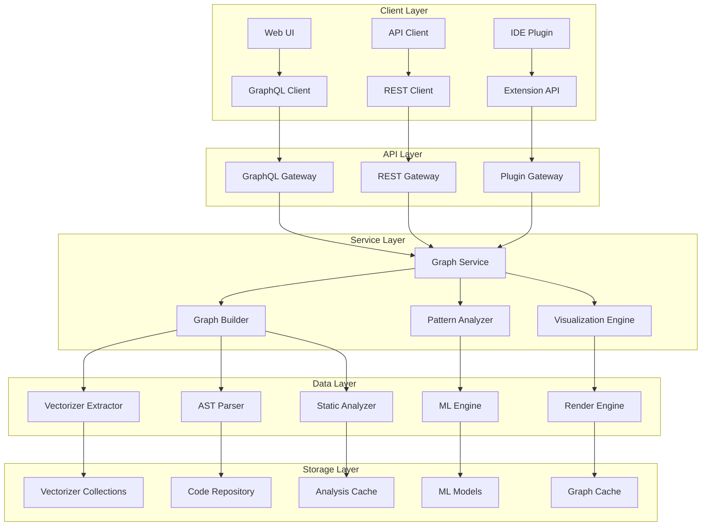

# Graph Correlation Analysis - Technical Design

## Architecture Overview

The Graph Correlation Analysis system is designed as a modular, scalable solution that integrates with the existing Nexus ecosystem to provide comprehensive code relationship analysis and visualization.

## System Architecture



## Core Components

### 1. Graph Service

The central service that orchestrates graph generation and provides API endpoints.

```rust
pub struct GraphService {
    builder: Arc<GraphBuilder>,
    analyzer: Arc<PatternAnalyzer>,
    renderer: Arc<VisualizationEngine>,
    cache: Arc<GraphCache>,
    vectorizer: Arc<VectorizerClient>,
}

impl GraphService {
    pub async fn generate_graph(&self, request: GraphRequest) -> Result<GraphResponse> {
        // 1. Validate request
        // 2. Check cache
        // 3. Extract data from vectorizer
        // 4. Build graph
        // 5. Analyze patterns
        // 6. Cache result
        // 7. Return response
    }
    
    pub async fn get_graph(&self, graph_id: &str) -> Result<Graph> {
        // Retrieve graph from cache or storage
    }
    
    pub async fn analyze_graph(&self, graph_id: &str, analysis: AnalysisRequest) -> Result<AnalysisResult> {
        // Perform analysis on existing graph
    }
}
```

### 2. Graph Builder

Responsible for constructing different types of graphs from extracted data.

```rust
pub trait GraphBuilder {
    async fn build_call_graph(&self, data: &ExtractedData) -> Result<CallGraph>;
    async fn build_dependency_graph(&self, data: &ExtractedData) -> Result<DependencyGraph>;
    async fn build_data_flow_graph(&self, data: &ExtractedData) -> Result<DataFlowGraph>;
    async fn build_component_graph(&self, data: &ExtractedData) -> Result<ComponentGraph>;
}

pub struct DefaultGraphBuilder {
    call_extractor: Arc<CallExtractor>,
    dependency_extractor: Arc<DependencyExtractor>,
    dataflow_extractor: Arc<DataFlowExtractor>,
    component_extractor: Arc<ComponentExtractor>,
    layout_engine: Arc<LayoutEngine>,
}
```

### 3. Vectorizer Extractor

Extracts relationship data from Vectorizer collections.

```rust
pub struct VectorizerExtractor {
    client: Arc<VectorizerClient>,
    cache: Arc<ExtractionCache>,
}

impl VectorizerExtractor {
    pub async fn extract_functions(&self, scope: &GraphScope) -> Result<Vec<FunctionInfo>> {
        // Query vectorizer for function definitions
        let query = FunctionQuery::new()
            .with_scope(scope)
            .with_metadata(true);
        
        self.client.search_intelligent(query).await
    }
    
    pub async fn extract_calls(&self, functions: &[FunctionInfo]) -> Result<Vec<CallInfo>> {
        // Extract function call relationships
        let mut calls = Vec::new();
        
        for function in functions {
            let call_query = CallQuery::new()
                .with_function_id(function.id)
                .with_context(true);
            
            let function_calls = self.client.search_intelligent(call_query).await?;
            calls.extend(function_calls);
        }
        
        Ok(calls)
    }
    
    pub async fn extract_imports(&self, scope: &GraphScope) -> Result<Vec<ImportInfo>> {
        // Extract import/export relationships
        let query = ImportQuery::new()
            .with_scope(scope)
            .with_dependencies(true);
        
        self.client.search_intelligent(query).await
    }
}
```

### 4. Pattern Analyzer

Identifies common patterns and architectural structures in the code.

```rust
pub trait PatternAnalyzer {
    async fn analyze_pipeline_patterns(&self, graph: &Graph) -> Result<Vec<PipelinePattern>>;
    async fn analyze_event_patterns(&self, graph: &Graph) -> Result<Vec<EventPattern>>;
    async fn analyze_architectural_patterns(&self, graph: &Graph) -> Result<Vec<ArchitecturalPattern>>;
    async fn analyze_design_patterns(&self, graph: &Graph) -> Result<Vec<DesignPattern>>;
}

pub struct DefaultPatternAnalyzer {
    pipeline_detector: Arc<PipelineDetector>,
    event_detector: Arc<EventDetector>,
    architecture_detector: Arc<ArchitectureDetector>,
    design_detector: Arc<DesignPatternDetector>,
    ml_engine: Arc<MLEngine>,
}
```

### 5. Visualization Engine

Handles graph rendering and visualization generation.

```rust
pub trait VisualizationEngine {
    async fn render_interactive(&self, graph: &Graph) -> Result<InteractiveVisualization>;
    async fn render_static(&self, graph: &Graph, format: ExportFormat) -> Result<Vec<u8>>;
    async fn generate_layout(&self, graph: &Graph, algorithm: LayoutAlgorithm) -> Result<GraphLayout>;
}

pub struct DefaultVisualizationEngine {
    web_renderer: Arc<WebRenderer>,
    static_renderer: Arc<StaticRenderer>,
    layout_engine: Arc<LayoutEngine>,
    export_engine: Arc<ExportEngine>,
}
```

## Data Models

### Core Graph Structures

```rust
#[derive(Debug, Clone, Serialize, Deserialize)]
pub struct Graph {
    pub id: String,
    pub graph_type: GraphType,
    pub nodes: Vec<Node>,
    pub edges: Vec<Edge>,
    pub metadata: GraphMetadata,
    pub layout: Option<GraphLayout>,
    pub statistics: GraphStatistics,
    pub created_at: DateTime<Utc>,
    pub updated_at: DateTime<Utc>,
}

#[derive(Debug, Clone, Serialize, Deserialize)]
pub struct Node {
    pub id: String,
    pub label: String,
    pub node_type: NodeType,
    pub metadata: NodeMetadata,
    pub position: Option<Position>,
    pub properties: HashMap<String, Value>,
    pub cluster_id: Option<String>,
}

#[derive(Debug, Clone, Serialize, Deserialize)]
pub struct Edge {
    pub id: String,
    pub source_id: String,
    pub target_id: String,
    pub edge_type: EdgeType,
    pub metadata: EdgeMetadata,
    pub weight: Option<f64>,
    pub properties: HashMap<String, Value>,
}

#[derive(Debug, Clone, Serialize, Deserialize)]
pub enum GraphType {
    CallGraph,
    DependencyGraph,
    DataFlowGraph,
    ComponentGraph,
    HybridGraph,
}

#[derive(Debug, Clone, Serialize, Deserialize)]
pub enum NodeType {
    Function,
    Method,
    Module,
    Package,
    Class,
    Interface,
    Variable,
    Parameter,
    ReturnValue,
    API,
    Database,
    Service,
    Component,
}

#[derive(Debug, Clone, Serialize, Deserialize)]
pub enum EdgeType {
    Calls,
    Imports,
    Exports,
    Inherits,
    Implements,
    Composes,
    Aggregates,
    Transforms,
    Queries,
    Publishes,
    Subscribes,
    Depends,
}
```

### Request/Response Models

```rust
#[derive(Debug, Serialize, Deserialize)]
pub struct GraphRequest {
    pub graph_type: GraphType,
    pub scope: GraphScope,
    pub filters: Option<GraphFilters>,
    pub options: GraphOptions,
}

#[derive(Debug, Serialize, Deserialize)]
pub struct GraphScope {
    pub collections: Vec<String>,
    pub file_patterns: Option<Vec<String>>,
    pub depth_limit: Option<usize>,
    pub include_external: bool,
    pub exclude_patterns: Option<Vec<String>>,
}

#[derive(Debug, Serialize, Deserialize)]
pub struct GraphFilters {
    pub min_call_frequency: Option<usize>,
    pub exclude_patterns: Vec<String>,
    pub include_patterns: Vec<String>,
    pub node_types: Option<Vec<NodeType>>,
    pub edge_types: Option<Vec<EdgeType>>,
    pub min_weight: Option<f64>,
    pub max_nodes: Option<usize>,
}

#[derive(Debug, Serialize, Deserialize)]
pub struct GraphOptions {
    pub layout_algorithm: LayoutAlgorithm,
    pub clustering_enabled: bool,
    pub metadata_level: MetadataLevel,
    pub export_formats: Vec<ExportFormat>,
    pub performance_mode: PerformanceMode,
}

#[derive(Debug, Serialize, Deserialize)]
pub struct GraphResponse {
    pub graph_id: String,
    pub graph: Graph,
    pub statistics: GraphStatistics,
    pub generation_time: Duration,
    pub warnings: Vec<String>,
    pub patterns: Vec<DetectedPattern>,
}
```

## API Design

### REST Endpoints

```rust
// Graph generation
POST /api/v1/graphs/generate
Content-Type: application/json
{
    "graph_type": "call_graph",
    "scope": {
        "collections": ["codebase", "functions"],
        "file_patterns": ["*.rs", "*.ts"],
        "depth_limit": 10,
        "include_external": false
    },
    "filters": {
        "min_call_frequency": 2,
        "exclude_patterns": ["test_*", "mock_*"],
        "node_types": ["function", "method"]
    },
    "options": {
        "layout_algorithm": "force_directed",
        "clustering_enabled": true,
        "metadata_level": "detailed",
        "export_formats": ["json", "svg"]
    }
}

// Graph retrieval
GET /api/v1/graphs/{graph_id}
Response: Graph

// Graph analysis
POST /api/v1/graphs/{graph_id}/analyze
Content-Type: application/json
{
    "analysis_type": "pattern_detection",
    "parameters": {
        "pattern_types": ["pipeline", "event_driven"],
        "min_confidence": 0.8
    }
}

// Graph visualization
GET /api/v1/graphs/{graph_id}/visualize
Query params: format, layout, interactive
Response: Visualization data or rendered image
```

### GraphQL Schema

```graphql
type Query {
    graph(id: ID!): Graph
    graphs(filter: GraphFilter): [Graph!]!
    graphTypes: [GraphType!]!
    analysis(graphId: ID!, analysisType: AnalysisType!): AnalysisResult
}

type Mutation {
    generateGraph(input: GraphRequest!): GraphResponse!
    updateGraph(id: ID!, input: GraphUpdateInput!): Graph!
    deleteGraph(id: ID!): Boolean!
}

type Subscription {
    graphUpdated(graphId: ID!): Graph!
    analysisCompleted(graphId: ID!): AnalysisResult!
}

type Graph {
    id: ID!
    type: GraphType!
    nodes: [Node!]!
    edges: [Edge!]!
    metadata: GraphMetadata!
    statistics: GraphStatistics!
    patterns: [Pattern!]!
    createdAt: DateTime!
    updatedAt: DateTime!
}

type Node {
    id: ID!
    label: String!
    type: NodeType!
    metadata: NodeMetadata!
    position: Position
    properties: [Property!]!
    cluster: Cluster
}

type Edge {
    id: ID!
    source: Node!
    target: Node!
    type: EdgeType!
    metadata: EdgeMetadata!
    weight: Float
    properties: [Property!]!
}

enum GraphType {
    CALL_GRAPH
    DEPENDENCY_GRAPH
    DATA_FLOW_GRAPH
    COMPONENT_GRAPH
    HYBRID_GRAPH
}

enum NodeType {
    FUNCTION
    METHOD
    MODULE
    PACKAGE
    CLASS
    INTERFACE
    VARIABLE
    PARAMETER
    RETURN_VALUE
    API
    DATABASE
    SERVICE
    COMPONENT
}

enum EdgeType {
    CALLS
    IMPORTS
    EXPORTS
    INHERITS
    IMPLEMENTS
    COMPOSES
    AGGREGATES
    TRANSFORMS
    QUERIES
    PUBLISHES
    SUBSCRIBES
    DEPENDS
}
```

## Performance Considerations

### Caching Strategy

```rust
pub struct GraphCache {
    memory_cache: Arc<LruCache<String, Graph>>,
    disk_cache: Arc<DiskCache>,
    redis_cache: Arc<RedisCache>,
}

impl GraphCache {
    pub async fn get(&self, key: &str) -> Option<Graph> {
        // 1. Check memory cache
        if let Some(graph) = self.memory_cache.get(key) {
            return Some(graph);
        }
        
        // 2. Check Redis cache
        if let Some(graph) = self.redis_cache.get(key).await {
            self.memory_cache.put(key.to_string(), graph.clone());
            return Some(graph);
        }
        
        // 3. Check disk cache
        if let Some(graph) = self.disk_cache.get(key).await {
            self.memory_cache.put(key.to_string(), graph.clone());
            return Some(graph);
        }
        
        None
    }
    
    pub async fn put(&self, key: &str, graph: Graph, ttl: Duration) {
        // Store in all cache layers
        self.memory_cache.put(key.to_string(), graph.clone());
        self.redis_cache.put(key, graph.clone(), ttl).await;
        self.disk_cache.put(key, graph, ttl).await;
    }
}
```

### Optimization Strategies

1. **Lazy Loading**: Load graph components on demand
2. **Incremental Updates**: Update only changed components
3. **Clustering**: Group related nodes to reduce complexity
4. **Level-of-Detail**: Show different detail levels based on zoom
5. **Parallel Processing**: Multi-threaded graph generation
6. **Streaming**: Stream large graphs in chunks

### Scalability Design

```rust
pub struct ScalableGraphService {
    load_balancer: Arc<LoadBalancer>,
    graph_services: Vec<Arc<GraphService>>,
    cache_cluster: Arc<CacheCluster>,
    message_queue: Arc<MessageQueue>,
}

impl ScalableGraphService {
    pub async fn generate_graph_distributed(&self, request: GraphRequest) -> Result<GraphResponse> {
        // 1. Route request to appropriate service instance
        let service = self.load_balancer.select_service(&request);
        
        // 2. Check if request can be processed in parallel
        if request.options.parallel_enabled {
            return self.generate_graph_parallel(service, request).await;
        }
        
        // 3. Process request on selected service
        service.generate_graph(request).await
    }
    
    async fn generate_graph_parallel(&self, service: Arc<GraphService>, request: GraphRequest) -> Result<GraphResponse> {
        // Split request into parallel tasks
        let tasks = self.split_request_into_tasks(request);
        
        // Execute tasks in parallel
        let results = futures::future::join_all(tasks).await;
        
        // Merge results
        self.merge_graph_results(results)
    }
}
```

## Security Considerations

### Authentication and Authorization

```rust
pub struct GraphSecurityManager {
    auth_service: Arc<AuthService>,
    permission_service: Arc<PermissionService>,
    audit_logger: Arc<AuditLogger>,
}

impl GraphSecurityManager {
    pub async fn authorize_graph_access(&self, user: &User, graph_id: &str) -> Result<bool> {
        // Check user permissions for graph access
        let permissions = self.permission_service.get_user_permissions(user.id).await?;
        
        if permissions.can_access_graph(graph_id) {
            self.audit_logger.log_access(user.id, graph_id).await;
            Ok(true)
        } else {
            self.audit_logger.log_denied_access(user.id, graph_id).await;
            Ok(false)
        }
    }
    
    pub async fn sanitize_graph_data(&self, graph: Graph, user: &User) -> Result<Graph> {
        // Remove sensitive data based on user permissions
        let sanitized_graph = self.filter_sensitive_data(graph, user).await?;
        Ok(sanitized_graph)
    }
}
```

### Data Privacy

1. **Code Confidentiality**: Ensure sensitive code remains private
2. **Access Control**: Implement proper authentication and authorization
3. **Audit Logging**: Track graph generation and access
4. **Data Encryption**: Encrypt sensitive graph data
5. **Anonymization**: Anonymize sensitive identifiers

## Integration Points

### Vectorizer Integration

```rust
pub struct VectorizerIntegration {
    client: Arc<VectorizerClient>,
    collection_manager: Arc<CollectionManager>,
    query_optimizer: Arc<QueryOptimizer>,
}

impl VectorizerIntegration {
    pub async fn extract_graph_data(&self, scope: &GraphScope) -> Result<ExtractedData> {
        // Optimize queries for graph extraction
        let optimized_queries = self.query_optimizer.optimize_for_graph_extraction(scope);
        
        // Execute queries in parallel
        let results = futures::future::join_all(
            optimized_queries.into_iter().map(|query| {
                self.client.search_intelligent(query)
            })
        ).await;
        
        // Merge and process results
        self.merge_extraction_results(results)
    }
}
```

### LLM Integration

```rust
pub struct LLMIntegration {
    context_provider: Arc<ContextProvider>,
    query_assistant: Arc<QueryAssistant>,
    documentation_generator: Arc<DocumentationGenerator>,
}

impl LLMIntegration {
    pub async fn provide_graph_context(&self, query: &str, graph: &Graph) -> Result<LLMContext> {
        // Extract relevant graph context for LLM query
        let context = self.context_provider.extract_context(query, graph).await?;
        
        // Enhance context with graph relationships
        let enhanced_context = self.enhance_with_relationships(context, graph).await?;
        
        Ok(enhanced_context)
    }
    
    pub async fn generate_documentation(&self, graph: &Graph) -> Result<Documentation> {
        // Generate documentation from graph structure
        self.documentation_generator.generate_from_graph(graph).await
    }
}
```

## Testing Strategy

### Unit Tests

```rust
#[cfg(test)]
mod tests {
    use super::*;
    
    #[tokio::test]
    async fn test_call_graph_generation() {
        let builder = create_test_graph_builder();
        let data = create_test_extraction_data();
        
        let graph = builder.build_call_graph(&data).await.unwrap();
        
        assert_eq!(graph.graph_type, GraphType::CallGraph);
        assert!(!graph.nodes.is_empty());
        assert!(!graph.edges.is_empty());
        
        // Verify call relationships
        for edge in &graph.edges {
            assert_eq!(edge.edge_type, EdgeType::Calls);
            assert!(edge.weight.is_some());
        }
    }
    
    #[tokio::test]
    async fn test_dependency_graph_generation() {
        let builder = create_test_graph_builder();
        let data = create_test_extraction_data();
        
        let graph = builder.build_dependency_graph(&data).await.unwrap();
        
        assert_eq!(graph.graph_type, GraphType::DependencyGraph);
        
        // Verify no circular dependencies
        assert!(!has_circular_dependencies(&graph));
    }
}
```

### Integration Tests

```rust
#[cfg(test)]
mod integration_tests {
    use super::*;
    
    #[tokio::test]
    async fn test_end_to_end_graph_generation() {
        let service = create_test_graph_service();
        let request = create_test_graph_request();
        
        let response = service.generate_graph(request).await.unwrap();
        
        assert!(response.graph_id.len() > 0);
        assert!(!response.graph.nodes.is_empty());
        assert!(response.generation_time.as_millis() < 5000); // < 5 seconds
    }
    
    #[tokio::test]
    async fn test_large_codebase_performance() {
        let service = create_test_graph_service();
        let request = create_large_codebase_request();
        
        let start = Instant::now();
        let response = service.generate_graph(request).await.unwrap();
        let duration = start.elapsed();
        
        assert!(duration.as_secs() < 30); // < 30 seconds for large codebase
        assert!(response.graph.nodes.len() > 1000);
    }
}
```

### Performance Tests

```rust
#[cfg(test)]
mod performance_tests {
    use super::*;
    
    #[tokio::test]
    async fn test_graph_generation_performance() {
        let service = create_test_graph_service();
        let requests = create_performance_test_requests();
        
        let mut total_time = Duration::new(0, 0);
        let mut success_count = 0;
        
        for request in requests {
            let start = Instant::now();
            match service.generate_graph(request).await {
                Ok(_) => {
                    total_time += start.elapsed();
                    success_count += 1;
                }
                Err(_) => {}
            }
        }
        
        let avg_time = total_time / success_count;
        assert!(avg_time.as_millis() < 2000); // < 2 seconds average
    }
}
```

This technical design provides a comprehensive foundation for implementing the Graph Correlation Analysis feature, ensuring scalability, performance, and maintainability while integrating seamlessly with the existing Nexus ecosystem.
